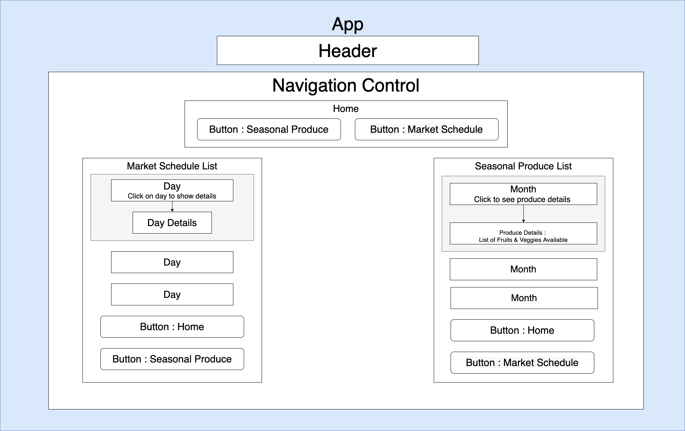

# **Farmer's Market**

#### Author: **Jessica Hvozdovich and Allison Mackey**
#### June 30, 2020

### Description

_This application serves as an introduction to React with create-react-app, components, JSX, and props while building a static site. The farmers market app displays a home page with two buttons - list of seasonal produce & the daily market schedule based off of which button the user clicks it will expand with detailed lists of each. The user will be able to click on each day/month and view detailed information dynamically._




### Instructions for use:

1. Open Terminal (macOS) or PowerShell (Windows)
2. To download the project Directory to your desktop enter the following commands:
```
cd Desktop
git clone https://github.com/amackey693/help-queue.gi
cd help-queue
```
3. To view the downloaded files, open them in a text editor or IDE of your choice.
* if you have VSCode for example, when your terminal is within the main project Directory you can open all of the files with the command:
```
code .
```
5. Download node and node package manager if they are not already installed on your device. You can find further instructions [here](https://www.learnhowtoprogram.com/intermediate-javascript/getting-started-with-javascript-8d3b52cf-3755-481d-80c5-46f1d3a8ffeb/installing-node-js-14f2721a-61e0-44b3-af1f-73f17348c8f4).
5. Run npm install in your terminal to download the necessary dependencies, plugins, and modules.
```
npm install
```
6. The command npm run start will build and open the compiled code in a browser of your choice using a local host.
```
npm run start
```

### Known Bugs

No bugs have been identified at the time of this update.

### Support and Contact Information

Please contact me with any suggestions or questions at jhvozdovich@gmail.com. Thank you for your input!  
_Have a bug or an issue with this application? [Open a new issue](https://github.com/amackey693/help-queue/issues) here on GitHub._

### Technologies Used

* JavaScript
* React
* JSX
* HTML
* Git and GitHub

### Specs
| Spec | Input | Output |
| :------------- | :------------- | :------------- |
| **User can view hard coded tickets on static site** | User Input:"localhost:3000" | Output: “Ticket List is displayed" |
| **User can request to add ticket and is prompted through three questions before the form is displayed** | User Input:"Add ticket" | Output: “Followed the steps? Asked another pair? Fifteen minutes researching? " |
| **Pressing "back" returns the user to the ticket list** | User Input:"Back" | Output: “Ticket List" |
| **A static, nonfunctional form is displayed if all questions are answred yes** | User Input:"localhost:3000" | Output: “Ticket List is displayed" |

#### License

This software is licensed under the MIT license.

Copyright © 2020 **_Jessica Hvozdovich and Allison Mackey_**
